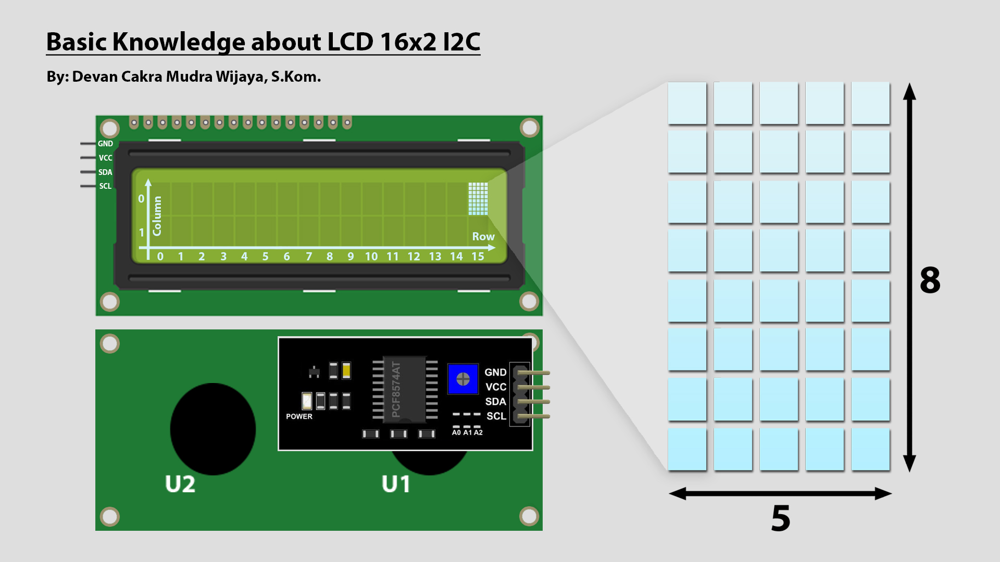
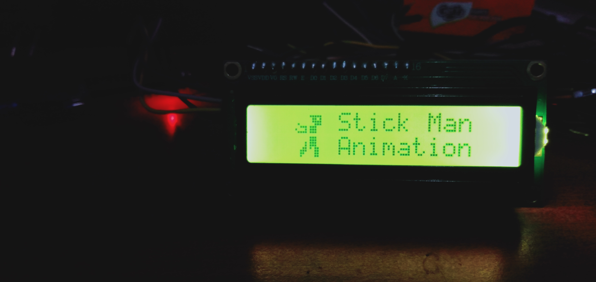
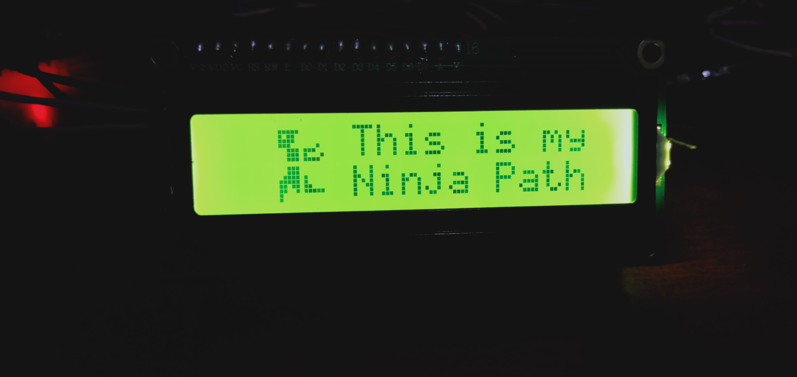

[](https://github.com/ellerbrock/open-source-badges/)
[](https://opensource.org/licenses/MIT)


# Arduino Nano-based Designing Stick Man Animation on LCD Screen
LCD berfungsi sebagai penampil karakter. Umumnya karakter yang ditampilkan itu berupa tulisan, namun sebenarnya LCD juga dapat menampilkan gambar, bahkan LCD juga bisa menampilkan suatu animasi dari hasil perulangan. Tujuan diadakannya proyek ini adalah untuk mengedukasi masyarakat tentang bagaimana cara membuat kustomisasi karakter yang mudah di LCD I2C. Proyek ini telah dilaksanakan dan memakan waktu kurang lebih 1 hari. Hasil dari proyek ini berupa animasi Stick Man.

<br><br>

## Kebutuhan Proyek
| Bagian | Deskripsi |
| --- | --- |
| Papan Pengembangan | Arduino Nano V3 |
| Editor Kode | Arduino IDE 1.8.19 (Versi Lama yang Stabil) |
| Driver | CH340 USB Driver |
| Protokol Komunikasi | Inter Integrated Circuit (I2C) |
| Bahasa Pemrograman | C/C++ |
| Pustaka Arduino | LiquidCrystal_I2C oleh Frank de Brabander (Versi: 1.1.2) |
| Layar | LCD I2C (x1) |
| Komponen Lainnya | • Kabel USB Mini - USB tipe A (x1)<br>• Kabel jumper (1 set) |

<br><br>

## Unduh & Instal
1. Arduino IDE

   <table><tr><td width="810">

   ```
   https://bit.ly/ArduinoIDE_Installer
   ```

   </td></tr></table><br>

2. CH340 USB Driver

   <table><tr><td width="810">

   ```
   https://bit.ly/CH340_USBdriver
   ```

   </td></tr></table>
   
<br><br>

## Rancangan Proyek
<table>
<tr>
<th width="420">Diagram Blok</th>
<th width="420">Diagram Ilustrasi</th>
</tr>
<tr>
<td></td>
<td></td>
</tr>
</table>
<table>
<tr>
<th width="840">Pengkabelan</th>
</tr>
<tr>
<td></td>
</tr>
</table>

<br><br>

## Pengetahuan Dasar

<br><br>

<strong>Gambar di atas menjelaskan bahwa LCD I2C 16x2 memiliki :</strong> 

<table><tr><td width="840">

• Kolom -> ``` 16 ```

• Baris -> ``` 2 ```

• Byte yang ada dalam matriks led -> ``` 8 ```

• Bit yang ada dalam matriks led -> masing-masing barisnya ada ``` 5 ```

</td></tr></table>

<br><br>

## Memindai Alamat I2C Yang Ada Pada LCD
<table><tr><td width="840">

```ino
/*
  =====================================================
  I2C Scanner untuk Arduino / ESP32 / ESP8266
  by: Devan Cakra Mudra Wijaya, S.Kom.
  =====================================================

  Fungsi:
  - Mendeteksi seluruh perangkat I2C yang terhubung
  - Menampilkan alamat perangkat dalam format HEX
  - Menampilkan jumlah perangkat yang ditemukan


  =====================================================
  Pin SDA dan SCL untuk Arduino / ESP32 / ESP8266
  =====================================================
  Koneksi I2C Arduino (default):
  - Arduino Uno / Nano (ATmega328P)
    SDA -> A4
    SCL -> A5

  - Arduino Mega 2560
    SDA -> D20
    SCL -> D21

  - Board Arduino lainnya
    SDA -> Pin SDA
    SCL -> Pin SCL
    (Lihat datasheet atau pinout board)

  Koneksi I2C ESP32 (default):
  SDA -> GPIO 21
  SCL -> GPIO 22

  Koneksi I2C ESP8266 (default):
  SDA -> GPIO 4 (D2)
  SCL -> GPIO 5 (D1)
*/

// Memanggil library Wire untuk komunikasi I2C
#include <Wire.h>

// Konstanta untuk menentukan jeda antar scan (5000 ms = 5 detik)
const uint32_t SCAN_INTERVAL = 5000;


// Fungsi untuk menginisialisasi komunikasi I2C
// Konfigurasi pin SDA dan SCL akan disesuaikan secara otomatis berdasarkan jenis board yang digunakan
void initI2C() {

  // Jika board yang digunakan adalah ESP32, maka:
  #if defined(ESP32)

    // Mengaktifkan komunikasi I2C
    // SDA = GPIO21
    // SCL = GPIO22
    Wire.begin(21, 22);

  // Jika board yang digunakan adalah ESP8266, maka:
  #elif defined(ESP8266)

    // Mengaktifkan komunikasi I2C
    // SDA = D2 (GPIO4)
    // SCL = D1 (GPIO5)
    Wire.begin(D2, D1);

  // Jika board yang digunakan bukan ESP32 maupun ESP8266
  // Contoh: Arduino Uno, Nano, Mega, Leonardo, dll, maka:
  #else

    // Mengaktifkan komunikasi I2C menggunakan pin hardware bawaan board
    Wire.begin();

  #endif

}


// Fungsi setup() dijalankan satu kali saat board pertama kali menyala atau reset
// Digunakan untuk inisialisasi perangkat keras, komunikasi serial, sensor, modul, dan konfigurasi awal program
void setup() {

  // Memulai komunikasi Serial dengan baud rate 115200
  Serial.begin(115200);

  // Mengecek apakah board menggunakan USB native
  // Contoh: Arduino Leonardo, Arduino Micro, beberapa ESP32-S2/S3
  #if defined(USBCON) || defined(ARDUINO_USB_CDC_ON_BOOT)

    // Jika iya, maka:
    // Program akan menunggu sampai Serial Monitor terhubung sebelum melanjutkan eksekusi program
    while (!Serial);

  #endif

  // Menunggu selama 2 detik sebelum program dimulai
  delay(2000);

  // Menampilkan header program
  Serial.println("====================================");
  Serial.println("         I2C DEVICE SCANNER         ");
  Serial.println("by: Devan Cakra Mudra Wijaya, S.Kom.");
  Serial.println("====================================");

  // Mencetak baris kosong
  Serial.println();

  // Menginisialisasi komunikasi I2C
  initI2C();
}


// Fungsi loop() dijalankan terus-menerus setelah Fungsi setup() selesai
// Seluruh logika utama program biasanya ditempatkan di dalam fungsi ini
void loop() {

  // Variabel untuk menyimpan kode error hasil komunikasi I2C
  uint8_t error;

  // Variabel untuk menyimpan alamat I2C yang sedang diperiksa
  uint8_t address;

  // Variabel penghitung jumlah device yang ditemukan
  uint8_t deviceCount = 0;

  // Menampilkan informasi bahwa proses scan dimulai
  Serial.println("------------------------------------");
  Serial.println("Scanning I2C bus...");
  Serial.println("------------------------------------");

  // Melakukan perulangan dari alamat 1 sampai 126
  // Alamat I2C valid adalah 0x01 sampai 0x7E
  for (address = 1; address < 127; address++) {

    // Memulai komunikasi ke alamat yang sedang diuji
    Wire.beginTransmission(address);

    // Mengakhiri transmisi dan menyimpan hasilnya
    // 0 = sukses
    // 1 = data terlalu panjang
    // 2 = NACK saat alamat dikirim
    // 3 = NACK saat data dikirim
    // 4 = error lain
    error = Wire.endTransmission();

    // Jika tidak ada error, maka:
    if (error == 0) {

      // Menampilkan informasi device ditemukan
      Serial.print("[FOUND] Device at address 0x");

      // Jika alamat kurang dari 16, maka:
      // Tambahkan angka 0 di depan agar format HEX rapi
      if (address < 16) {
        Serial.print("0");
      }

      // Menampilkan alamat dalam format HEX
      Serial.println(address, HEX);

      // Menambah jumlah device yang ditemukan
      deviceCount++;
    }

    // Jika terjadi error tidak dikenal, maka:
    else if (error == 4) {

      // Menampilkan pesan error
      Serial.print("[ERROR] Unknown error at address 0x");

      // Jika alamat kurang dari 16, maka:
      // Tambahkan angka 0 di depan agar format HEX rapi
      if (address < 16) {
        Serial.print("0");
      }

      // Menampilkan alamat yang bermasalah dalam format HEX
      Serial.println(address, HEX);
    }

    // Jika error selain 0 atau 4, maka:
    // Diabaikan, biasanya ini terjadi karena tidak ada perangkat pada alamat tersebut
  }

  // Mencetak baris kosong
  Serial.println();

  // Jika tidak ada device ditemukan, maka:
  if (deviceCount == 0) {

    // Tampilkan pesan tidak ada device
    Serial.println("No I2C devices found.");
  }
  else { // Jika setidaknya satu perangkat ditemukan, maka:

    // Menampilkan jumlah device yang ditemukan
    Serial.print("Total devices found: ");

    // Menampilkan nilai deviceCount
    Serial.println(deviceCount);
  }

  // Menampilkan informasi waktu scan berikutnya
  Serial.print("Next scan in ");

  // Mengubah milidetik menjadi detik
  Serial.print(SCAN_INTERVAL / 1000);

  // Menampilkan satuan detik
  Serial.println(" seconds.");

  // Baris kosong
  Serial.println("\n");

  // Menunggu selama 5 detik sebelum scan ulang
  delay(SCAN_INTERVAL);
}
```

</td></tr></table><br><br>

## Pengaturan Arduino IDE
1. Buka ``` Arduino IDE ``` terlebih dahulu, kemudian buka proyek ini dengan cara klik ``` File ``` -> ``` Open ``` : 

   <table><tr><td width="810">
      
      ``` stickman_animation_lcd.ino ```

   </td></tr></table><br>
   
2. ``` Pengaturan Board ``` di Arduino IDE

   <table>
      <tr><th width="810">

      Cara mengatur board ``` Arduino Nano ```
            
      </th></tr>
      <tr><td width="810">
         
      Pilih papan dengan mengklik: ``` Tools ``` -> ``` Board ``` -> ``` Arduino AVR Boards ``` -> ``` Arduino Nano ```

      </td></tr>
   </table><br>

3. ``` Ubah Processor ``` di Arduino IDE

   <table><tr><td width="810">
      
      Klik ``` Tools ``` -> ``` Processor ``` -> ``` ATmega328P (Old Bootloader) ```

   </td></tr></table><br>

4. ``` Instal Pustaka ``` di Arduino IDE

   <table><tr><td width="810">
      
      Unduh semua file zip pustaka. Kemudian tempelkan di: ``` C:\Users\Computer_Username\Documents\Arduino\libraries ```

   </td></tr></table><br>

5. ``` Pengaturan Port ``` di Arduino IDE

   <table><tr><td width="810">
      
      Klik ``` Port ``` -> Pilih sesuai dengan port perangkat anda ``` (anda dapat melihatnya di Device Manager) ```

   </td></tr></table><br>

6. Sebelum mengunggah program, silakan klik: ``` Verify ```.<br><br>

7. Jika tidak ada kesalahan dalam kode program, silakan klik: ``` Upload ```.<br><br>

8. Jika masih ada masalah saat unggah program, maka coba periksa pada bagian ``` driver ``` / ``` port ``` / ``` yang lainnya ```.

<br><br>

## Karakter Khusus LCD
Untuk membuat Karakter Khusus LCD dengan mudah, anda dapat mengakses tautan di bawah ini.

<table><tr><td width="840">
      
```
https://maxpromer.github.io/LCD-Character-Creator/
```

</td></tr></table>

<br><br>

## Memulai
1. Unduh dan ekstrak repositori ini.<br><br>

2. Pastikan anda memiliki komponen elektronik yang diperlukan.<br><br>
   
3. Pastikan komponen anda telah dirancang sesuai dengan diagram.<br><br>
   
4. Konfigurasikan perangkat anda menurut pengaturan di atas.<br><br>

5. Selamat menikmati [Selesai].

<br><br>

## Sorotan
<table>
<tr>
<th width="420">Tampilan animasi-1</th>
<th width="420">Tampilan animasi-2</th>
</tr>
<tr>
<td></td>
<td></td>
</tr>
</table>

<br><br>

## Apresiasi
Jika karya ini bermanfaat bagi anda, maka dukunglah karya ini sebagai bentuk apresiasi kepada penulis dengan mengklik tombol ``` ⭐Bintang ``` di bagian atas repositori.

<br><br>

## Penafian
Aplikasi ini merupakan hasil karya saya sendiri dan bukan merupakan hasil plagiat dari penelitian atau karya orang lain, kecuali yang berkaitan dengan layanan pihak ketiga yang meliputi: pustaka, kerangka kerja, dan lain sebagainya.

<br><br>

## LISENSI
LISENSI MIT - Hak Cipta © 2024 - Devan C. M. Wijaya, S.Kom

Dengan ini diberikan izin tanpa biaya kepada siapa pun yang mendapatkan salinan perangkat lunak ini dan file dokumentasi terkait perangkat lunak untuk menggunakannya tanpa batasan, termasuk namun tidak terbatas pada hak untuk menggunakan, menyalin, memodifikasi, menggabungkan, mempublikasikan, mendistribusikan, mensublisensikan, dan/atau menjual salinan Perangkat Lunak ini, dan mengizinkan orang yang menerima Perangkat Lunak ini untuk dilengkapi dengan persyaratan berikut:

Pemberitahuan hak cipta di atas dan pemberitahuan izin ini harus menyertai semua salinan atau bagian penting dari Perangkat Lunak.

DALAM HAL APAPUN, PENULIS ATAU PEMEGANG HAK CIPTA DI SINI TETAP MEMILIKI HAK KEPEMILIKAN PENUH. PERANGKAT LUNAK INI DISEDIAKAN SEBAGAIMANA ADANYA, TANPA JAMINAN APAPUN, BAIK TERSURAT MAUPUN TERSIRAT, OLEH KARENA ITU JIKA TERJADI KERUSAKAN, KEHILANGAN, ATAU LAINNYA YANG TIMBUL DARI PENGGUNAAN ATAU URUSAN LAIN DALAM PERANGKAT LUNAK INI, PENULIS ATAU PEMEGANG HAK CIPTA TIDAK BERTANGGUNG JAWAB, KARENA PENGGUNAAN PERANGKAT LUNAK INI TIDAK DIPAKSAKAN SAMA SEKALI, SEHINGGA RISIKO ADALAH MILIK ANDA SENDIRI.
